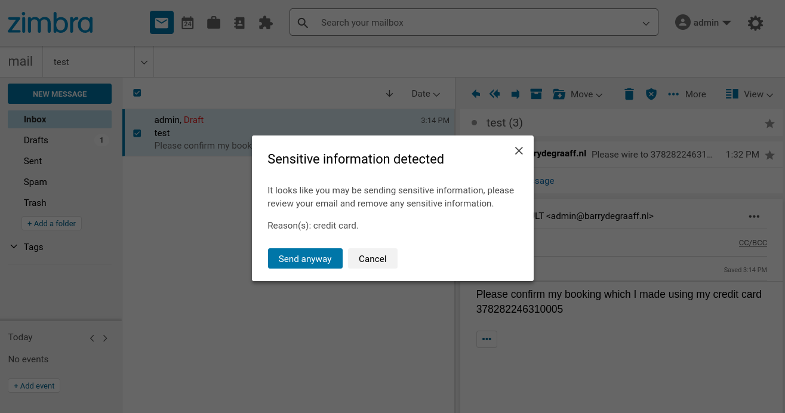

# Data loss prevention Zimlet

This proof-of-concept Zimlet offers data loss prevention based on Presidio. It warns the user when sending sensitive information like credit card or social security numbers.

***Production use not recommended*** this Zimlet is a proof-of-concept, meaning it will query Presidio via Zimbra Proxy using _/analyze_ and _/anonymize_. These endpoints are not protected by any means. Meaning: authentication, CSRF and DoS protections have not been implemented.

For this Zimlet to go to production a Java extension needs to be developed, that will take care of the above and will eliminate the need for a customization of Zimbra proxy template files. The idea is for interested parties to try out the Data loss prevention Zimlet and if enough interest for it exists the extension will be developed.



## Installing

This Zimlet needs to access Presidio which runs in Docker, for now it can be installed on the mailbox server only.

```
# Add Docker's official GPG key:
sudo apt-get update
sudo apt-get install ca-certificates curl gnupg
sudo install -m 0755 -d /etc/apt/keyrings
curl -fsSL https://download.docker.com/linux/ubuntu/gpg | sudo gpg --dearmor -o /etc/apt/keyrings/docker.gpg
sudo chmod a+r /etc/apt/keyrings/docker.gpg

# Add the repository to Apt sources:
echo \
  "deb [arch="$(dpkg --print-architecture)" signed-by=/etc/apt/keyrings/docker.gpg] https://download.docker.com/linux/ubuntu \
  "$(. /etc/os-release && echo "$VERSION_CODENAME")" stable" | \
  sudo tee /etc/apt/sources.list.d/docker.list > /dev/null
sudo apt-get update

apt-cache policy docker-ce
sudo apt install docker-ce
sudo systemctl status docker
docker pull mcr.microsoft.com/presidio-analyzer
docker pull mcr.microsoft.com/presidio-anonymizer
docker run -d -p 5001:3000 mcr.microsoft.com/presidio-analyzer:latest
docker run -d -p 5002:3000 mcr.microsoft.com/presidio-anonymizer:latest
```

## Configuring Zimbra Proxy

Add to `/opt/zimbra/conf/nginx/templates/nginx.conf.web.https.default.template` just before the final `}` the following:

```
location ^~ /analyze/ {
    proxy_pass http://127.0.0.1:5001/analyze;
}

location ^~ /anonymize/ {
    proxy_pass http://127.0.0.1:5002/anonymize;
}
```

And run as the `zimbra` user:

```
zmproxyctl restart
```

Please note that changes to the nginx template file will be removed when installing Zimbra patches and upgrades.

## Installing the Zimlet

Download the latest zip file from the releases page and deploy as the `zimbra` user as follows:

```
zmzimletctl deploy zimbra-zimlet-dlp.zip
zmmailboxdctl restart
```

## Test/verify Presidio installation

Use curl from the command line on your Zimbra mailbox server to test if Presidio is working in Docker: 

```
curl -d '{"text":"John Smith drivers license is AC432223", "language":"en"}' -H "Content-Type: application/json" -X POST http://127.0.0.1:5001/analyze

[{"analysis_explanation": null, "end": 10, "entity_type": "PERSON", "score": 0.85, "start": 0}, {"analysis_explanation": null, "end": 38, "entity_type": "US_DRIVER_LICENSE", "score": 0.6499999999999999, "start": 30}]

curl -X POST http://127.0.0.1:5002/anonymize -H "Content-type: application/json" --data "{\"text\": \"John Smith drivers license is AC432223\", \"analyzer_results\": [{\"start\": 30, \"end\": 38, \"score\": 0.6499999999999999, \"entity_type\": \"US_DRIVER_LICENSE\"}],  \"anonymizers\": {\"DEFAULT\": { \"type\": \"replace\", \"new_value\": \"ANONYMIZED\" },\"PHONE_NUMBER\": { \"type\": \"mask\", \"masking_char\": \"*\", \"chars_to_mask\": 4, \"from_end\": true }}}"

{"text": "John Smith drivers license is ANONYMIZED", "items": [{"start": 30, "end": 40, "entity_type": "US_DRIVER_LICENSE", "text": "ANONYMIZED", "operator": "replace"}]}
```

If this works, you can try to access Presidio via Zimbra Proxy, using:

```
curl -d '{"text":"John Smith drivers license is AC432223", "language":"en"}' -H "Content-Type: application/json" -X POST https://zimbra.example.com/analyze
```

## Further reading

- https://presidio-demo.azurewebsites.net/
- https://github.com/microsoft/presidio
- https://microsoft.github.io/presidio/samples/python/presidio_notebook/
- https://microsoft.github.io/presidio/api-docs/api-docs.html#tag/Anonymizer/paths/~1anonymize/post

And....

- https://www.paypalobjects.com/en_GB/vhelp/paypalmanager_help/credit_card_numbers.htm

